# GPU Passthrough (Intel VA-API)

> [!info] Scope
> End-to-end trace of the Intel GPU's path from a physical PCI slot on the
> Proxmox host into a running Jellyfin container, across all three layers:
> Proxmox hardware mapping, Terraform VM config, and the Ansible
> `media_platform` role.

## Four hops

```mermaid
flowchart LR
    subgraph PVE["Proxmox host"]
        PHYS["Physical GPU<br/>PCI 0000:03:00.0, id 8086:56a5<br/>IOMMU group 15"]
        MAP["proxmox_hardware_mapping_pci<br/>'transcoding_gpu'<br/>(defined once, in _base)"]
    end

    subgraph TF["Terraform (deployments/media/infrastructure)"]
        DS["data.proxmox_hardware_mapping_pci<br/>looked up, not redefined"]
        PCIE["local.pcie_devices map<br/>{hostpci0 = {mapping='transcoding_gpu'}}"]
        MODVAR["module.media_vm<br/>pcie_devices = local.pcie_devices"]
    end

    subgraph MOD["modules/proxmox_vm"]
        SWITCH["gpu_passthrough = length(pcie_devices) > 0"]
        MTYPE["machine=q35, bios=ovmf<br/>+ efi_disk block"]
        HOSTPCI["dynamic hostpci block<br/>on the VM resource"]
    end

    subgraph VM["Guest VM"]
        DRI["/dev/dri/renderD128<br/>exposed to guest OS"]
    end

    subgraph ANS["Ansible: media_platform role"]
        DRIVERS["gpu.yml: intel-media-va-driver-non-free,<br/>vainfo, intel-gpu-tools, video/render groups"]
        MOUNT["docker-compose.yml.j2: jellyfin<br/>devices: /dev/dri/renderD128"]
    end

    PHYS --> MAP --> DS --> PCIE --> MODVAR --> SWITCH
    SWITCH --> MTYPE
    SWITCH --> HOSTPCI --> DRI
    DRI --> DRIVERS --> MOUNT

    classDef proxmox fill:#E57000,color:#fff,stroke:#b35800
    classDef tf fill:#7B42BC,color:#fff,stroke:#5a2f8f
    classDef ans fill:#0969da,color:#fff,stroke:#0550ae
    class PHYS,MAP proxmox
    class DS,PCIE,MODVAR,SWITCH,MTYPE,HOSTPCI tf
    class DRI,DRIVERS,MOUNT ans
```



VA-API transcoding depends on all four hops at once. A gap in any one leaves
a VM that boots normally and a Jellyfin instance that falls back to software
transcoding.

## Hop 1: the Proxmox-side hardware mapping

```hcl
resource "proxmox_hardware_mapping_pci" "transcoding_gpu" {
  name = "transcoding_gpu"
  map = [
    {
      comment      = "GPU specific for media transcoding"
      node         = "pve"
      id           = "8086:56a5"
      iommu_group  = 15
      path         = "0000:03:00.0"
      subsystem_id = "1849:6004"
    },
  ]
}
```
(`workspace/infrastructure/_base/main-gpu.tf`, full file)

This is a **cluster-scoped** Proxmox resource: a named hardware mapping, not
a per-VM setting. `_base` defines it once. It identifies the physical device
by PCI vendor:device ID (`8086:56a5`, Intel), bus path, IOMMU group, and
subsystem ID. `node`, `path`, and `iommu_group` come from the host itself
(`lspci`, `/sys/kernel/iommu_groups/`), so moving to different hardware
means new values for this resource and only this resource.

## Hop 2: Terraform reads the mapping and builds the module input

`workspace/deployments/media/infrastructure/main.tf` looks the mapping up
instead of redefining it:

```hcl
data "proxmox_hardware_mapping_pci" "transcoding_gpu" {
  name = "transcoding_gpu"
}

locals {
  pcie_map = [
    data.proxmox_hardware_mapping_pci.transcoding_gpu.name,
  ]

  pcie_devices = {
    for idx, name in local.pcie_map : "hostpci${idx}" => {
      device  = "hostpci${idx}"
      mapping = name
      pcie    = true
      rombar  = true
    }
  }
}
```
(`workspace/deployments/media/infrastructure/main.tf`, excerpt)

This follows the pattern in [Engineering decisions](engineering-decisions.md)
and [Provisioning](provisioning.md): `_base` *defines* shared, cluster-scoped
resources and every other stack *reads* them, so a deployment stack never
owns (or destroys) a cluster resource. `pcie_devices` becomes a one-entry
map, `{"hostpci0" = {device="hostpci0", mapping="transcoding_gpu",
pcie=true, rombar=true}}`, passed straight through as
`module "media_vm" { pcie_devices = local.pcie_devices }`.

## Hop 3: the module's single-variable switch

Inside `workspace/modules/proxmox_vm/main.tf`:

```hcl
gpu_passthrough = length(var.pcie_devices) > 0
```
```hcl
machine = local.gpu_passthrough ? "q35" : "pc"
bios    = local.gpu_passthrough ? "ovmf" : "seabios"
```
```hcl
dynamic "efi_disk" {
  for_each = local.gpu_passthrough ? [1] : []
  content {
    datastore_id = var.datastore_infra
    file_format  = "raw"
    type         = "4m"
  }
}
```
```hcl
dynamic "hostpci" {
  for_each = var.pcie_devices
  content {
    device  = hostpci.value["device"]
    mapping = hostpci.value["mapping"]
    pcie    = hostpci.value["pcie"]
    rombar  = hostpci.value["rombar"]
  }
}
```

One input, "is `pcie_devices` non-empty?", produces three coupled outcomes:
`q35` machine type, OVMF/UEFI BIOS, and an EFI disk. PCIe passthrough does
not function on `i440fx` + SeaBIOS, so the module's interface offers no path
to a passthrough VM on the wrong machine type (see
[Engineering decisions](engineering-decisions.md)).

`pcie` and `rombar` stay separate per device. `pcie` selects the PCIe bus
over legacy PCI; `rombar` controls whether the guest sees the device's ROM
BAR. Both default to `true` in the `pcie_devices` object type, and the media
stack sets both explicitly.

## Hop 4: guest OS and container requirements

PCI passthrough makes `/dev/dri/renderD128` *available inside the VM's
kernel*, given the right guest driver. A working Jellyfin transcode needs
three more pieces, all inside the `media_platform` Ansible role and none
visible from Terraform.

### 1. Guest-OS driver packages (`roles/media_platform/tasks/gpu.yml`)

```yaml
- name: Esure GPU packages are installed
  ansible.builtin.apt:
    name:
      - "linux-modules-extra-{{ ansible_kernel }}"
    state: present
    update_cache: true
  notify: Reboot

- name: Esure GPU/Transcoding tools packages are installed
  ansible.builtin.apt:
    name:
      - linux-firmware
      - intel-gpu-tools
      - vainfo
      - intel-media-va-driver-non-free
    state: present
    update_cache: true

- name: Ensure Media User GPU groups
  ansible.builtin.user:
    name: "{{ media_platform_user }}"
    groups:
      - video
      - render
    append: true

- name: Reboot if needed
  ansible.builtin.meta: flush_handlers
```
(`ansible/roles/media_platform/tasks/gpu.yml`, full file)

`linux-modules-extra-{{ ansible_kernel }}` supplies kernel modules missing
from the base kernel package. Installing it queues a reboot, and `gpu.yml`
**runs that reboot immediately** through `meta: flush_handlers` instead of
deferring it to end-of-play (see [Configuration](configuration.md)).
`compose.yml`, the next task file in the role, starts containers that mount
`/dev/dri/renderD128`, and the new kernel modules must be active before
Jellyfin starts.

`intel-media-va-driver-non-free` is the **non-free** iHD driver. The
open-source `intel-media-va-driver` lacks support for newer Intel hardware
acceleration features, so the role installs the non-free package
deliberately.

The role adds the `media` service user to the host's `video` and `render`
groups. `/dev/dri/renderD128` is group-owned, and containers inherit
host-level device permissions through the bind mount, so device access fails
at the OS permission layer without this membership even when the device
node exists.

### 2. Container-level device mount and environment

```yaml
jellyfin:
  environment:
    DOCKER_MODS: "linuxserver/mods:jellyfin-opencl-intel"
    NEOReadDebugKeys: "1"
    OverrideGpuAddressSpace: "48"
  devices:
    - /dev/dri/renderD128:/dev/dri/renderD128
```
(`ansible/roles/media_platform/templates/docker-compose.yml.j2`, excerpt)

- `DOCKER_MODS: linuxserver/mods:jellyfin-opencl-intel` pulls Intel's OpenCL
  runtime in at container start. Jellyfin's hardware tone mapping and other
  OpenCL features need it, separately from the VA-API decode/encode path.
- `NEOReadDebugKeys` and `OverrideGpuAddressSpace` configure Intel's `neo`
  compute runtime inside a container on certain iGPU generations. Without
  them, some Intel GPUs report the wrong addressable memory space and
  hardware acceleration fails.
- The container mounts only `/dev/dri/renderD128`, the render-only node, not
  the whole `/dev/dri` directory or the display-capable `card0` node.

### 3. `vainfo` and `intel-gpu-tools` for diagnostics

Both install on the host, not inside the container. `vainfo` on the **host**
confirms whether the VA-API driver stack sees the device at all,
independently of Docker or Jellyfin.
