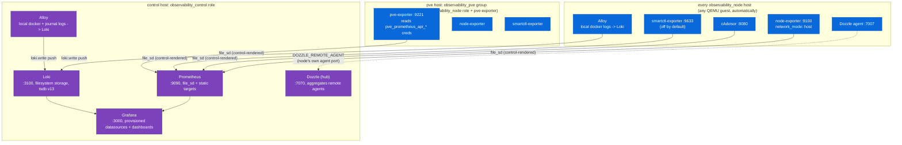

# Observability Stack

> [!info] Scope
> Deep dive into `ansible/roles/observability_control` and
> `observability_node`: the scrape topology, the log path, and how a host
> joins monitoring. The root README's runtime-topology diagram is the map;
> this page is the territory underneath it.

## Control vs. node-local



`observability_control` runs on `control` (192.168.0.60) only.
`observability_node` runs on every host in that group, which per
[Configuration](configuration.md) means every QEMU guest automatically plus
the `pve` host through `observability_pve` in `10_observability.ini`.

## What each exporter scrapes

| Exporter | Where it runs | What it reads | Enabled by default? |
|---|---|---|---|
| `node-exporter` | Every `observability_node` host, `network_mode: host` | Host `/proc`, `/sys`, and root filesystem (`--path.rootfs=/host` and friends) | Yes |
| `cAdvisor` | Every `observability_node` host | Container-level metrics through `/rootfs`, `/var/run`, `/sys`, `/var/lib/docker` bind mounts | Yes |
| `smartctl-exporter` | `observability_node` hosts with the flag on | Devices `/dev/sda`, `/dev/sdb`, `/dev/sdc`, `/dev/sdd`, `/dev/nvme0` | **No**, gated by `observability_node_smartctl_exporter_enabled`; `true` for `observability_pve` |
| `pve-exporter` | Proxmox host only, through `observability_node_pve_exporter_enabled` | Proxmox API, using the *third* credential in `pve.sops.yaml` (`pve_prometheus_api_*`, see [Secrets](secrets.md)) | **No**; `true` for `observability_pve` |
| `Alloy` | Every host (control and node) | Docker socket (`discovery.docker`) for container logs, plus optionally the systemd journal | Docker logs: yes. Journal: `observability_node_alloy_journal_enabled`, `true` for `observability_pve` |

The node role's smartctl-exporter maps its device list statically in
`ansible/roles/observability_node/templates/docker-compose.yml.j2`; the
control role's equivalent maps `/dev/nvme0` only. A host with a different
disk layout takes its device list from that template.

`group_vars/observability_pve` sets three booleans for the Proxmox host:

```yaml
---
observability_node_alloy_journal_enabled: true
observability_node_pve_exporter_enabled: true
observability_node_smartctl_exporter_enabled: true
```
(`ansible/inventory/group_vars/observability_pve`, full file)

`pve-exporter` runs `prometheus-pve-exporter` against the local PVE API,
which only the Proxmox host serves.

## Prometheus target discovery: `file_sd`

`observability_control`'s `prometheus.yml.j2` mixes two patterns:

```yaml
  - job_name: Control Node-Exporter
    static_configs:
      - targets: ["host.docker.internal:{{ observability_control_node_exporter_host_port }}"]
# ...
  - job_name: Node Node-Exporter
    file_sd_configs:
      - files:
          - /etc/prometheus/file_sd/node_exporter.yml
        refresh_interval: 30s
```
(`ansible/roles/observability_control/templates/prometheus/prometheus.yml.j2`, excerpt)

Control-local exporters use `static_configs`, fixed at render time, since
only one control host exists. Every **node** exporter comes through
`file_sd_configs` pointing at four rendered files under
`/etc/prometheus/file_sd/`, one per exporter type. The `prometheus.yml` task
in `observability_control` renders each from a template listed in
`observability_control_prometheus_file_sd_configs` (`pve_exporter`,
`smartctl_exporter`, `node_exporter`, `cadvisor`):

```jinja
---

- targets:
    - "{{ hostvars[host]['ansible_host'] }}:{{ hostvars[host]['observability_node_cadvisor_host_port'] }}"
  labels:
    instance: "{{ host }}"

```
(`ansible/roles/observability_control/templates/prometheus/file_sd/cadvisor.yml.j2`, full file)

Each template loops over `groups['observability_node']` and reads the
target's address and **its own exporter's port** from `hostvars`:
`observability_node_node_exporter_host_port`,
`observability_node_cadvisor_host_port`,
`observability_node_smartctl_exporter_host_port`, or
`observability_node_pve_exporter_host_port`. The `pve_exporter` and
`smartctl_exporter` templates also skip hosts whose matching `_enabled` flag
is false, so Prometheus only scrapes exporters that run.

Prometheus re-reads the four files every 30 seconds (`refresh_interval:
30s`). The file contents come from an Ansible template render and change
when `observability_control` runs again against the control host. A new VM
that lands in `observability_node` (automatically, through
`proxmox_all_qemu`) enters the scrape list on the next
`ansible-playbook site.yml --tags observability` run, which regenerates all
four files.

## The log path: Alloy to Loki

Every host (control and node) runs Grafana Alloy with near-identical config
(`observability_control/templates/alloy/alloy-config.yml.j2` and the node
equivalent share their structure line for line):

```
discovery.docker "docker_scrape" { host = "unix:///var/run/docker.sock" ... }
discovery.relabel "docker_scrape" { ... container name -> "container" label ... }
loki.source.docker "docker_scrape" { targets = ...; forward_to = [loki.write.default.receiver] }
loki.write "default" { endpoint { url = "{{ ..._loki_remote_url }}" } }
```

Every Alloy instance pushes **directly** to the control host's Loki
(`loki_remote_url: http://{{ control_host_ip }}:{{ loki_host_port }}/loki/api/v1/push`
in `group_vars/observability`). No local buffering tier or per-node Loki
sits in between. Journal collection (`loki.source.journal`) depends on
`{alloy_role}_alloy_journal_enabled`, which only the PVE host turns on.

Loki runs single-node, filesystem-backed, with an `inmemory` ring: no
replication and no object storage, consistent with homelab scale. Loki HA
would take a redesign, not a config flag.

## Dozzle: control hub, per-node agents

Every node runs a Dozzle **agent** (`command: agent`), publishing container
port `7007` on `observability_node_dozzle_host_port`. The control host runs
the full Dozzle UI on `dozzle_host_port` (`7070`) and connects to the agents
listed in a rendered env file:

```jinja
DOZZLE_REMOTE_AGENT=

{{ hostvars[host]['ansible_host'] }}:{{ hostvars[host]['observability_node_dozzle_host_port'] }}|{{ host }}{{"," if not loop.last}}

```
(`ansible/roles/observability_control/templates/dozzle/dozzle.env.j2`, full file)

The agent port flows through the standard re-export chain:

1. `group_vars/observability` sets `dozzle_node_port: 7007` alongside the
   control UI's `dozzle_host_port: 7070`.
2. `group_vars/observability_node` maps it onto the role:
   `observability_node_dozzle_host_port: "{{ dozzle_node_port }}"`.
3. The node role publishes `7007:7007`.
4. The control role reads each node's `observability_node_dozzle_host_port`
   from `hostvars`, so every `DOZZLE_REMOTE_AGENT` entry carries the port
   that node actually publishes, including any per-host override.

## How a newly provisioned host joins monitoring

1. Terraform's `proxmox_vm` module tags the new VM (default `["terraform"]`
   plus the deployment's tags, see [Provisioning](provisioning.md)). Being a
   QEMU guest is enough; no monitoring-specific tag applies.
2. Ansible's dynamic inventory plugin discovers the VM on the next inventory
   parse (`community.proxmox.proxmox`, `want_facts: true`).
3. As a QEMU guest, the VM belongs to the implicit `proxmox_all_qemu` group,
   which `10_observability.ini` wires into `observability_node:children`.
   No Ansible file changes.
4. The `observability_control` role, run against the control host,
   regenerates the `file_sd` target files and the Dozzle env file. The
   `observability_node` role, run against the new host, starts its exporters,
   Dozzle agent, and Alloy.
5. `ansible-playbook site.yml` imports `observability_control.yml` and
   `observability_node.yml` in order, covering both halves in one run.

Inventory membership follows automatically from the tag. Active monitoring
follows from the next Ansible run that touches both the control host and the
new node.

## Grafana dashboards

`roles/observability_control/files/grafana/provisioning/dashboards/` holds
`container.json`, `server.json`, `storage.json`, and `thermals.json`, plus
`provider.yml`. Grafana's file provisioner (`foldersFromFilesStructure:
true`) loads every JSON file in the directory, so the dashboards live in git
and survive container rebuilds.
